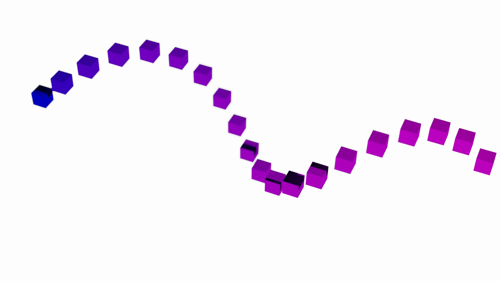
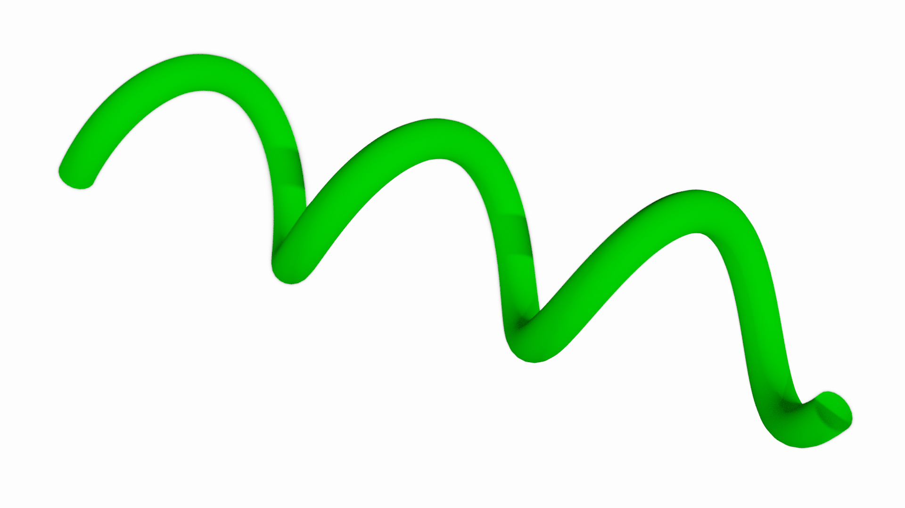
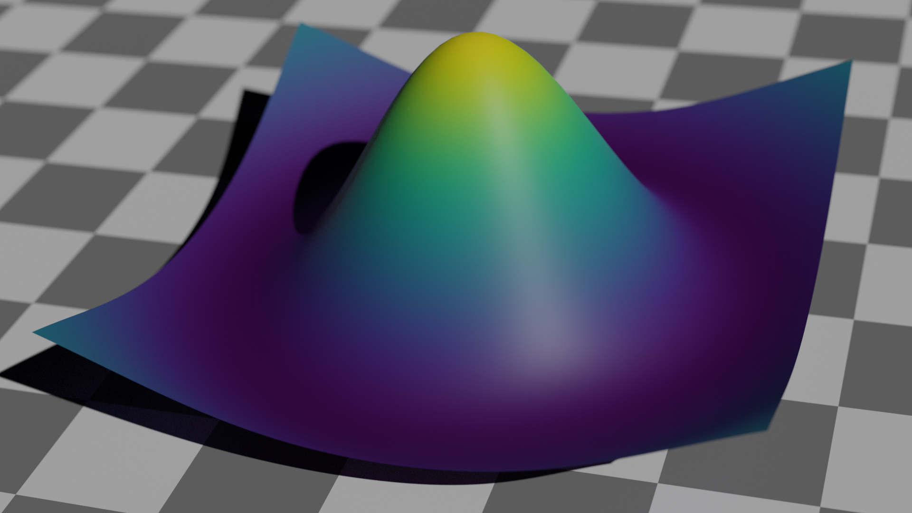
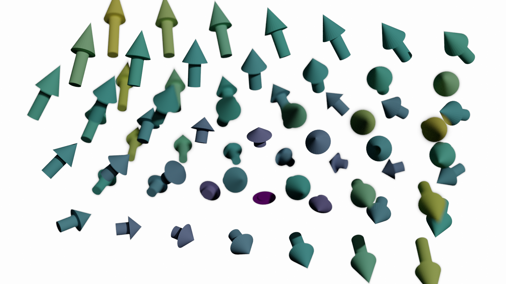
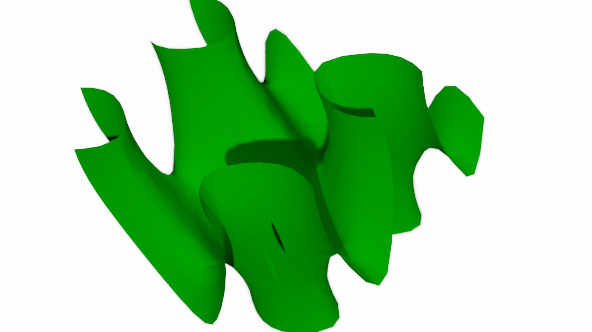
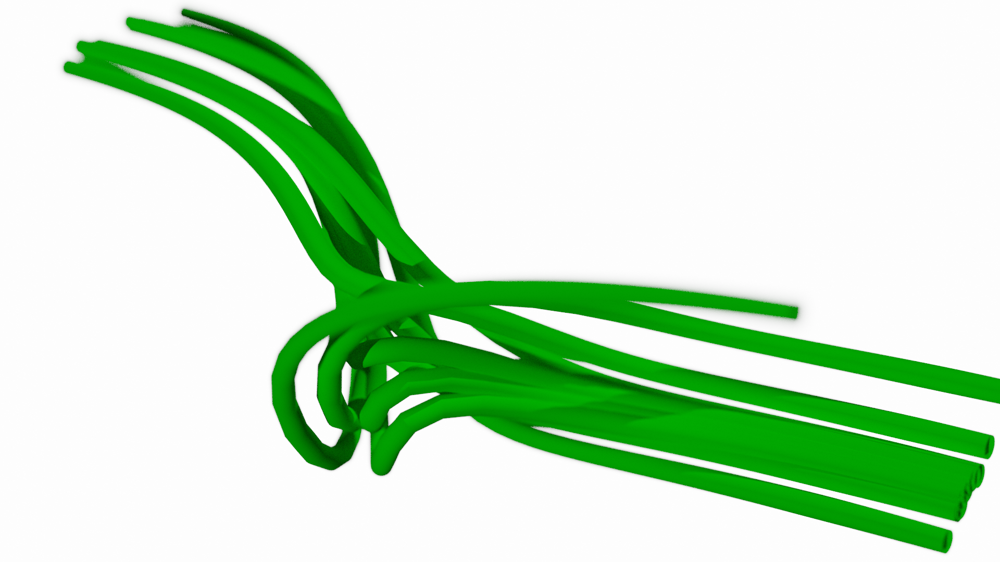
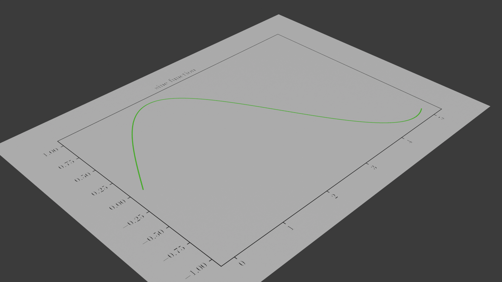

.. BlenDaViz documentation master file, created by
   sphinx-quickstart on Fri Feb 26 14:34:58 2021.
   You can adapt this file completely to your liking, but it should at least
   contain the root `toctree` directive.

*********
BlenDaViz
*********

Set Up
======

BlenDaViz requires Blender version 4.4 or above (including Blender 5.0). It also requires the Python libraries numpy, scipy, matplotlib and scikit-image.

Blender can be installed via a package manager or downloaded as binary files from https://www.blender.org/download/.

Finding Blender's Python Executable
-----------------------------------

You need to use Blender's bundled Python interpreter to install dependencies and run BlenDaViz. To find the path to Blender's Python executable, open Blender, switch to a Python console (Shift + F4) and type:

.. code:: python

   import sys
   print(sys.executable)

This will print a path like :code:`/usr/share/blender/4.4/python/bin/python3.11` or similar.

Installing BlenDaViz
--------------------

1. Clone or download the BlenDaViz repository:

.. code:: bash

   git clone https://github.com/SimonCan/BlenDaViz.git
   cd BlenDaViz

2. Install BlenDaViz and its dependencies using Blender's Python:

.. code:: bash

   /path/to/blenders/python -m pip install .

Replace :code:`/path/to/blenders/python` with the actual path you found above.

Alternatively, you can install the dependencies separately:

.. code:: bash

   /path/to/blenders/python -m pip install numpy scipy matplotlib scikit-image

And then add the BlenDaViz directory to your Python path within Blender.

Verifying the Installation
--------------------------

Once you start Blender, open a Python console and type:

.. code:: python

   import blendaviz as blt

If no errors appear, you are ready to go.

Usage and Examples
==================

Open Blender and within Blender a Python console.
Import BlendaViz and numpy:

.. code:: python

   import blendaviz as blt
   import numpy as np

Marker Plots
------------

In this simple line plot we will create some data and plot them. We will also see how we can manipulate existing plots.

.. code:: python

   # Create the data.
   y = np.linspace(0, 6*np.pi, 20)
   x = 2*np.cos(y/2)
   z = 2*np.sin(y/2)

   # Generate the scatter plot.
   pl = blt.plot(x, y, z, marker='cube', radius=0.7)

   # Change the color.
   pl.color = np.ones([x.shape[0], 4])
   pl.color[:, 0]  = np.linspace(0, 1, 20)
   pl.color[:, 1] = 0
   pl.plot()

Now you can render the scene by pressing F12.

Line Plots
----------

A line plot is very similar to a marker plot. It draws the data points as a line/tube.

.. code:: python

   import blendaviz as blt
   import numpy as np

   # Generate the data.
   y = np.linspace(0, 6*np.pi, 400)
   x = 2*np.cos(y)
   z = 2*np.sin(y)

   # Generate the line plot.
   pl = blt.plot(x, y, z, radius=0.5)

Mesh Plots
----------
We can plot 2d data arrays using :code:`mesh`. We need two 2d arrays containing the x and y coordinates of the data points.

.. code:: python

   import numpy as np
   import blendaviz as blt

   # Generate the data.
   x0 = np.linspace(-3, 3, 20)
   y0 = np.linspace(-3, 3, 20)
   x, y = np.meshgrid(x0, y0, indexing='ij')
   z = (1 - x**2-y**2)*np.exp(-(x**2+y**2)/5)

   # Genereate the mesh plot.
   mesh = blt.mesh(x, y, z)

Quiver Plots
------------

For three-dimensional vector arrays we can user quiver to plot the vector field as arrows. We need the x, y and z-coordinates of the data points as 3d arrays.

.. code:: python

   import numpy as np
   import blendaviz as blt

   # Generate the data.
   x = np.linspace(-3, 3, 3)
   y = np.linspace(-7, 7, 7)
   z = np.linspace(-3, 3, 3)
   xx, yy, zz = np.meshgrid(x, y, z, indexing='ij')
   uu = 0.3*(xx + yy)
   vv = 0.3*xx
   ww = 0.3*zz + 0.8

   # Genereate the quiver plot.
   quiver = blt.quiver(xx, yy, zz, uu, vv, ww, length='magnitude', color='magnitude')

Contour Plots
-------------

Three-dimensional scalar fields can be plotted using :code:`contour`. We need the x, z and z-coordinates of the data points as 3d arrays.

.. code:: python

   import blendaviz as blt

   # Generate the data.
   x = np.linspace(-2, 2, 21)
   y = np.linspace(-2, 2, 21)
   z = np.linspace(-2, 2, 21)
   xx, yy, zz = np.meshgrid(x, y, z, indexing='ij')
   phi = np.sin(3*xx) + np.cos(2*yy) + np.sin(zz)

   # Genereate the contour plot.
   contour = blt.contour(phi, xx, yy, zz)

Streamline Plots
----------------

A three-dimensional vector field can be plotted as streamlines. For that we need specify the three components of the vector field as 3d arrays, the coordinates of the data points as 3d arrays and the position or number of seeds. If the number of seeds is passed, they will be randomly distributed within the domain.

.. code:: python

   import numpy as np
   import blendaviz as blt

   # Generate the data.
   x = np.linspace(-4, 4, 100)
   y = np.linspace(-4, 4, 100)
   z = np.linspace(-4, 4, 100)
   xx, yy, zz = np.meshgrid(x, y, z, indexing='ij')
   u = -yy*np.exp(-np.sqrt(xx**2+yy**2) - zz**2)
   v = np.ones_like(u)*0.1
   w = xx*np.exp(-np.sqrt(xx**2+yy**2) - zz**2)

   # Define the position of the seeds.
   seeds = np.array([np.random.random(10)*2-1, np.zeros(10), np.random.random(10)*2-1]).T

   # Generate the streamline plot.
   streamlines = blt.streamlines(x, y, z, u, v, w, seeds=seeds, integration_time=100, integration_steps=80)

Matplotlib Bridge
-----------------

With BlenDaViz you can also generate plots in Matplotlib and embedthem into your Blender scene. The approach is very simple. You first generate the Matplotlib plot as you would normally do in Python, with no restrictions. Then you use BlenDaViz' command :code:`mpl_figure_to_blender` on the generated Matplotlib figure for the generation of the textured plane:

.. code:: python

   import numpy as np
   import matplotlib.pyplot as plt
   import blendaviz as blt   

   # Define the data.
   x = np.linspace(0, 5, 1000)
   y = np.sin(x)   

   # Plot the test data into a Matplotlib figure.
   plt.rc('text', usetex=True)
   plt.rc('font', family='arial')
   fig = plt.figure()
   plt.plot(x, y, color='g')
   plt.title("sine function")   

   # Generate a texture Blender plane with this plot.
   mpl = blt.mpl_figure_to_blender(fig)

The generated :code:`mpl` object has the Matplotlib figure object as member. It can be change to e.g. reflect different plotting style or data. Using :code:`mpl.plot()` would the replot the data.

Plotting Without the Blender GUI
================================

There are a few occasions that you do not want to start the Blender GUI, like you don't have any compatible graphics driver installed on your system, you want to run the plot in the background, or you are on a cluster with SSH access. Computationally intensive rendering should be ideally done on a powerful computer and done over night or even several days. Here we outline how to make a plot without the GUI.

We present two methods for performing a background plot. The first method is the easier one, but it requires the usage of the GUI to set up the scene, i.e. light, camera and additional rendering options. The second methods requires more coding, but is runs purely in the background.

Using the GUI to set up the scene.
----------------------------------

1. Open Blender and remove the default cube.
2. Adjust any other scene and rendering options.
3. Save your scence to something like :code:`my_plot.blend`.
4. Prepare the plotting routine using BlenDaViz and save it to something like :code:`my_plot.py`.
5. Start Blender from the command line using the prepared scene and the plotting script.

.. code:: bash

   blender --background my_plot.blend -P my_plot.py

This will use your blender scene and execute the plotting script.

Preparing the scene without the GUI, using the Blender Python commands.
----------------------------------------------------------------------

This requires a few lines of coding, as we perform all of the steps done in the GUI using the Blender Python commands. Not all of the below steps are required, but highly recommended.

The steps in the script are basically:
1. Remove any existing objects from the default scene, like the default cube at the origin.
2. (Optionally, Recommended) Adjust the background and rendering options.
3. Perform the BlenDaViz plot.
4. Render the scene and save the image.

You then need to run the script using

.. code:: bash

   blender -P my_script.py

It should be evident that using a loop you can generate animations through a sequence of images. You can use ffmpeg to put the images into a video file.

.. code:: python

   # line_plot_background.py
   '''
   Plotting example for a line plot in the background.
   Usage:
   blender -P line_plot_background.py
   '''

   import blendaviz as blt
   import numpy as np
   import bpy

   # Delete all existing objects, like the default cube, light and camera.
   bpy.ops.object.select_all(action='SELECT')
   bpy.ops.object.delete(use_global=False)

   # Change the background color.
   bpy.data.worlds["World"].node_tree.nodes["Background"].inputs[0].default_value = (1, 1, 1, 1)
   bpy.data.worlds["World"].node_tree.nodes["Background"].inputs[1].default_value = 5
   bpy.context.scene.world.cycles_visibility.scatter = False
   bpy.context.scene.world.cycles_visibility.diffuse = False
   bpy.context.scene.world.cycles_visibility.glossy = False
   bpy.context.scene.world.cycles_visibility.transmission = False

   # Change the rendering options.
   bpy.context.scene.render.engine = 'CYCLES'
   bpy.context.scene.render.threads_mode = 'FIXED'
   bpy.context.scene.render.threads = 4
   bpy.context.scene.cycles.samples = 256
   bpy.context.scene.render.resolution_x = 1920
   bpy.context.scene.render.resolution_y = 1080

   # Generate the data.
   y = np.linspace(0, 6*np.pi, 400)
   x = 2*np.cos(y)
   z = 2*np.sin(y)

   # Generate the line plot.
   pl = blt.plot(x, y, z, radius=0.5)

   # Render the image.
   bpy.data.scenes['Scene'].render.filepath = 'line_plot.png'
   bpy.ops.render.render(write_still=True)

