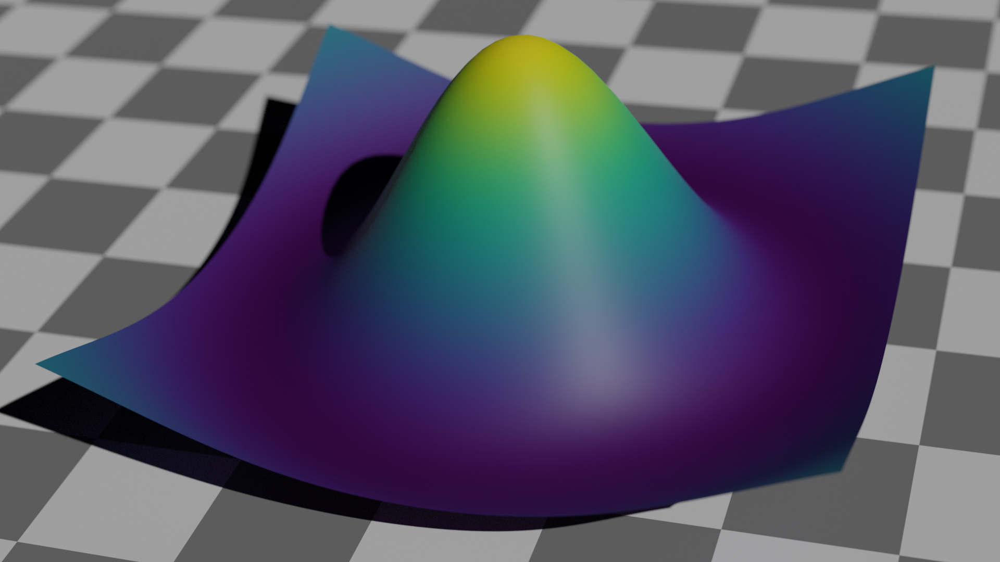

# Summary

BlenDaViz is a 3d plotting library for the visualization tool Blender, written in Python.
It is able to visualize line plots, scatter plots, surfaces,
iso-surfaces, glyphs (arrows) and streamlines from Numpy arrays.
The user can load BlenDaViz within a Blender Python console as any other library.
Its design is close to other plotting libraries, especially Matplotlib, which means that
every part of a plot is treated as an object that can be changed when updating the plot
with new parameters or data.
Compared to other 3d visualization software, we achieve higher image quality, thanks to Blender's
ray tracing capabilities.

# Statement of need

In scientific fields, like structure mechanics, computational fluid dynamics,
astrophysics, or molecular dynamics, it is common to use 3d visualization tools
like [Paraview](https://www.paraview.org) [@Ahrens2005],
[Vapor](https://www.vapor.ucar.edu) [@vapor],
[Mayavi](https://pypi.org/project/mayavi) or
[Visit](https://wci.llnl.gov/simulation/computer-codes/visit).
They are capable to load a variety of data formats and visualize different
aspects of the data using filters.
However, they often lack the image quality needed that would make understanding
the data easy.
Their limited shaders can create optical illusions where the depth of the geometry
is not clear, or the colors are off due to unrealistic image generation.

Realistically rendered or ray-traced images, like those generated by 3d
modelling tools like [Blender](https://www.blender.org), not only improve the image
quality, but make it easier to understand the three-dimensional structure
and colors.
For instance, contextually-implied scattered light can have a significant impact
on the perceived color of objects, as exemplified by *The Dress* controversy [@chetverikov2016seeing].
Using lighting, shadow, depth and scattering can be used to generate photorealistic images
where the interpretation is made easier.

So far Blender has seen only limited use in 3d data visualization.
[Bioblender](http://www.bioblender.org) has been developed specifically
for biological data and requires significant Blender knowledge.
Similarly, suggestions to use Blender in Astrophysics [@Kent-2015]
require the generation of the geometry by hand.
High quality plots by the Oak [Ridge National Laboratory](https://www.olcf.ornl.gov/2011/08/03/ornl-animations-garner-peer-praise-and-prizes)
shows that to achieve high quality a collaboration between Blender experts and
scientists is sometimes required.

Attempts to libraries we made with
[AstroBlend](https://www.astroblend.com) [@NAIMAN201650]
and [BlenderSciViz](https://github.com/zeffii/BlenderSciViz),
but their applications are relatively limited and they have not been maintained in years.
Perhaps [BVtkNodes](https://github.com/simboden/BVtkNodes) stands out,
as it is able to load VTK data and apply filters on it.

With [BlenDaViz](https://github.com/SimonCan/BlenDaViz) [@candelaresi_2025_15988189]
we give the users all the rendering and ray tracing
capabilities of Blender, combined with the ease of use and modularity we know
from libraries like [Matplotlib](https://matplotlib.org) [@Hunter2007; @matplotlib].
It is general purpose, thanks to the implementation of some of the most
used 3d plotting methods.

# Design

With BlenDaViz we keep the design very close to Matplotlib.
The input data is in the form of Numpy arrays and the
resulting plots are objects that can be freely modified.
These objects contain members, such as the data and parameters
(e.g.\ color), and methods, like the plotting function.
That way, the user can modify their plots and replot them.
An example is shown here:

    import blendaviz as blt
    import numpy as np

    # Generate the data.
    y = np.linspace(0, 6*np.pi, 400)
    x = 2*np.cos(y)
    z = 2*np.sin(y)

    # Generate the line plot.
    pl = blt.plot(x, y, z, radius=0.5)

    # Change the data.
    pl.x = 2*pl.x

    # Replot the data.
    pl.plot()

Every of our plotting functions follows a similar pipeline.
As the plotting function is called, the input is checked for consistency.
Then any existing geometry or textures for this plot are deleted.
Depending on the plotting function, different kind
of meshes are generated (lines, surfaces, arrows, etc.).
To finalize the plot object a texture is added.
Geometry and texture are then part of the plotting object
and can, in principle, be accessed.
After the geometry generation we add lights and a camera,
if not already present.

An example is shown in \autoref{fig: mesh_plot} where
we plot a two-dimensional array as a surface with the values
used as $z$-coordinates and colors.
To highlight its geometry we added a plane with a checker board
texture in the background and readjusted the camera.
Such manual adjustments can be done directly in Blender
and can greatly improve the plot quality.

{height="150pt"}

# Handling of time

We make handling time dependent data easy in BlenDaViz.
All that is required is that the data arrays contain
one more dimension.
For instance, if we want to plot the position of $n$ particles
at $p$ different times, our arrays $x$, $y$ and $z$ would
have the shape $[n, p]$.
Parameters that take the same shape, like colors,
follow the same structure.

BlenDaViz recognizes the data and input parameters as time dependent.
It then adds the plotting method of this plot object
to the `bpy.app.handlers.frame_change_pre` handler of Blender.
That way, any change in the time,via e.g.\ the slider,
results in an update of all present plots.

# Acknowledgements

This work was supported by a grant from the Simons Foundation\ (1013657, JL).
This work has been carried out within the framework of the EUROfusion Consortium, via the Euratom
Research and Training Programme (Grant Agreement No 101052200 — EUROfusion) and funded by the Swiss
State Secretariat for Education, Research and Innovation (SERI).
Views and opinions expressed are however those of the author(s) only and do not necessarily reflect
those of the European Union, the European Commission, or SERI.
Neither the European Union nor the European Commission nor SERI can be held responsible for them.
This project has benefited from funding by the Deutsche Forschungsgemeinschaft (DFG, German Research Foundation)
through the research unit FOR 5409 "Structure-Preserving Numerical Methods for Bulk- and Interface Coupling of
Heterogeneous Models (SNuBIC)" (project number 463312734).
We like to thank Dr.\ David MacTaggart for suggestions to improve the manuscript.

# References
